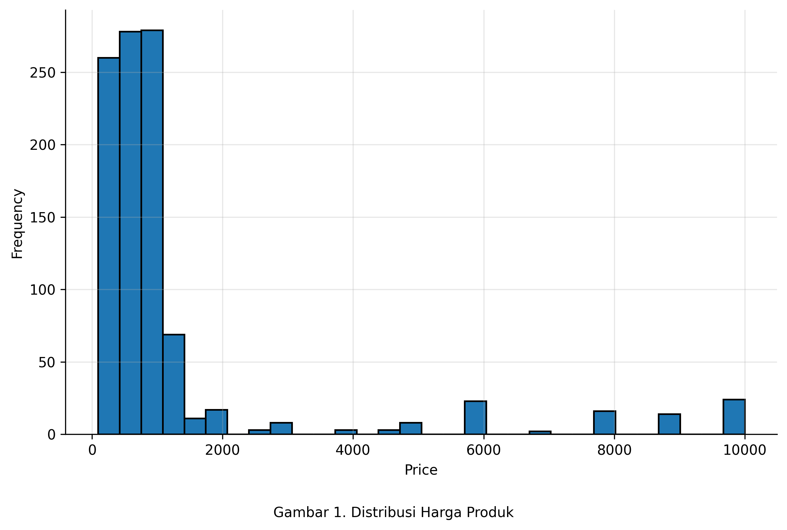
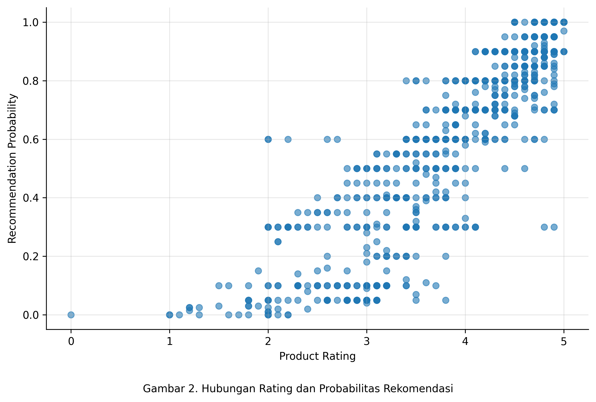
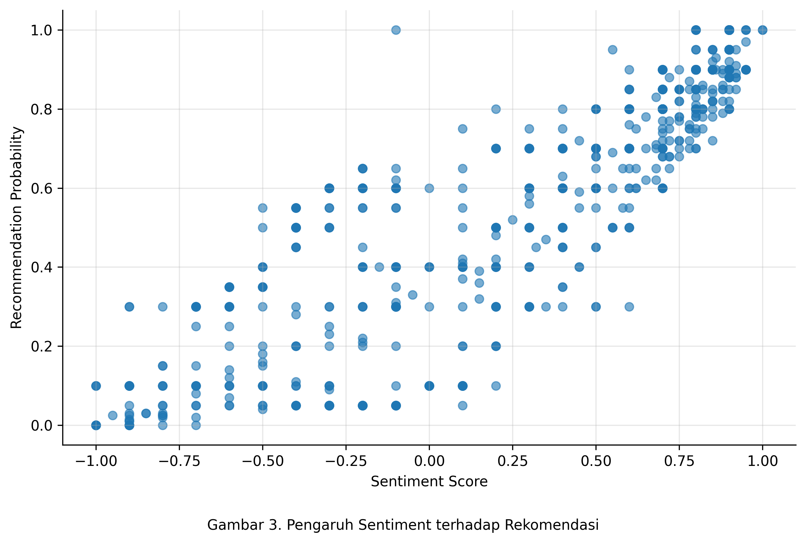
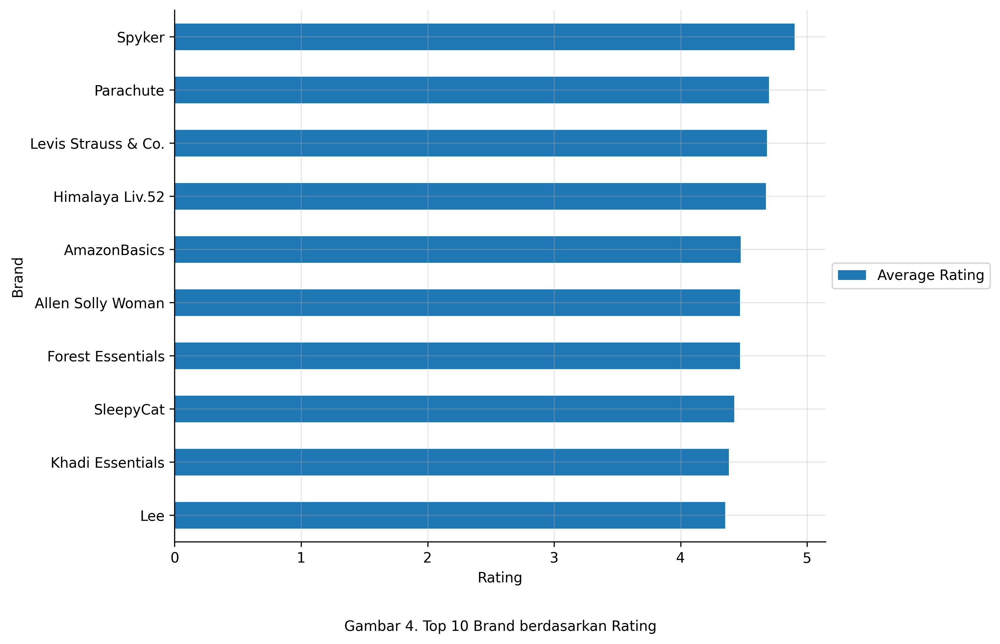
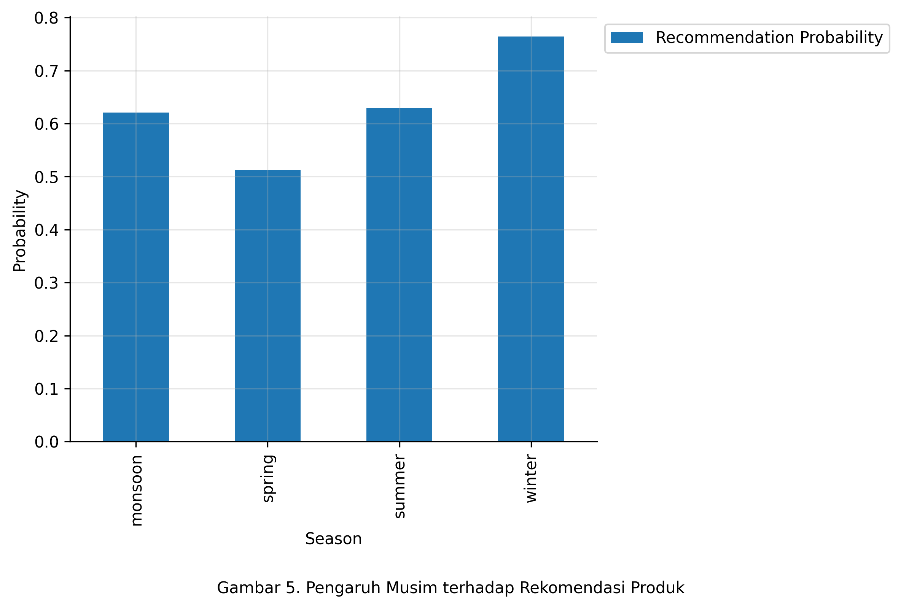
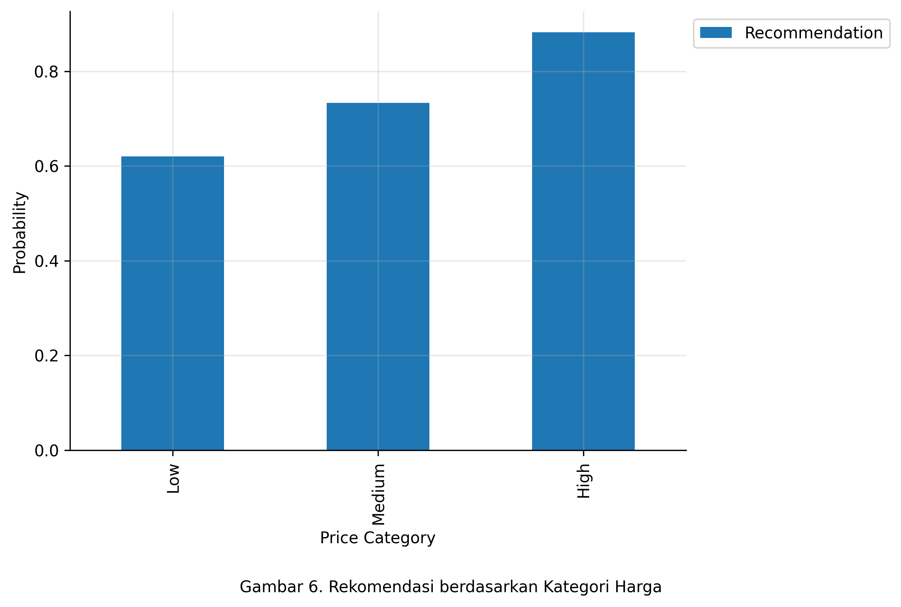
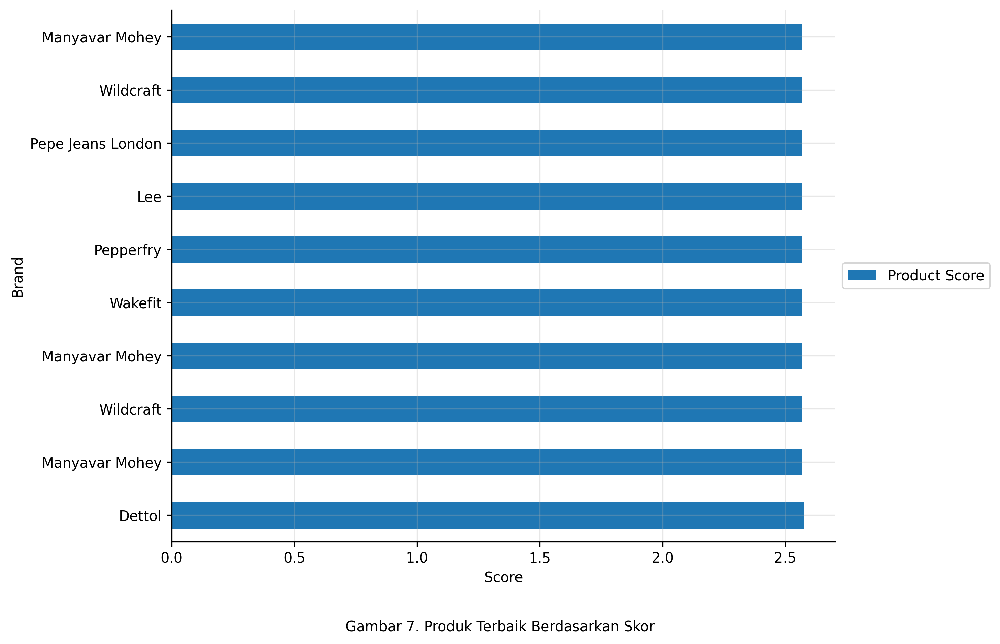
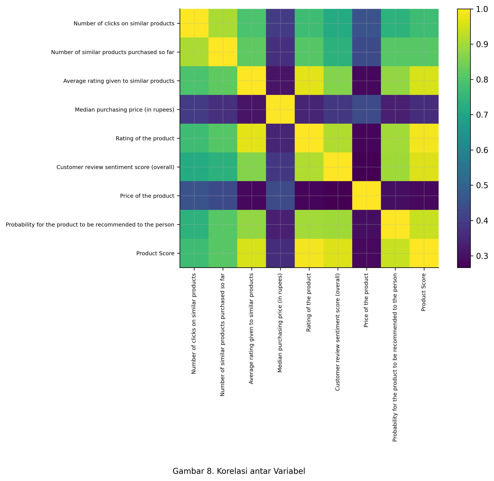

# Analisis Data E-Commerce untuk Sistem Rekomendasi Produk

---

## Ringkasan Proyek

Proyek ini bertujuan untuk menganalisis faktor-faktor yang mempengaruhi **probabilitas suatu produk direkomendasikan kepada pelanggan** dalam konteks e-commerce.

Analisis dilakukan menggunakan pendekatan **Exploratory Data Analysis (EDA)** untuk menghasilkan insight yang dapat digunakan dalam pengambilan keputusan bisnis.

---

## Tujuan Analisis

* Mengidentifikasi faktor utama yang mempengaruhi rekomendasi produk
* Menganalisis pengaruh rating, sentiment, harga, dan season
* Memberikan rekomendasi strategi berbasis data

---

## 📂 Sumber Dataset

Dataset diperoleh dari Kaggle: https://www.kaggle.com/datasets/kartikeybartwal/ecomerce-product-recommendation-dataset

🔗 *Ecommerce Product Recommendation Dataset (Content-Based Filtering)*
Dataset ini berisi informasi terkait:

* Rating produk
* Sentiment review pelanggan
* Harga produk
* Brand
* Season
* Probabilitas rekomendasi

Dataset ini digunakan untuk mensimulasikan sistem rekomendasi berbasis konten (content-based filtering).

---

## ⚙️ Tools yang Digunakan

* Python
* Pandas
* Matplotlib

---

## 📁 Struktur Proyek

```id="r8qz9u"
PTF_DATA_ANALYSIS/
│
├── Data/
│   └── Ecommerce Product.csv
│
├── output/
│   ├── price_distribution.png
│   ├── rating_vs_recommendation.png
│   ├── sentiment_analysis.png
│   ├── brand_analysis.png
│   ├── season_analysis.png
│   ├── price_segment.png
│   ├── top_products.png
│   └── correlation.png
│
├── analysis.py
└── README.md
```

---

# HASIL ANALISIS

## 1. Distribusi Harga Produk



**Insight:**
Sebagian besar produk berada pada rentang harga rendah hingga menengah, dengan beberapa outlier pada harga tinggi.
➡️ Harga bukan satu-satunya faktor utama dalam keputusan pelanggan.

---

## 2. Hubungan Rating dengan Probabilitas Rekomendasi



**Insight:**
Semakin tinggi rating produk, semakin tinggi kemungkinan produk direkomendasikan.
➡️ Rating merupakan faktor paling dominan dalam sistem rekomendasi.

---

## 3. Pengaruh Sentiment terhadap Rekomendasi



**Insight:**
Sentiment review pelanggan memiliki hubungan positif dengan probabilitas rekomendasi.
➡️ Pengalaman pelanggan (customer experience) sangat berpengaruh.

---

## 4. Brand dengan Rating Tertinggi



**Insight:**
Brand tertentu memiliki rating konsisten tinggi yang menunjukkan tingkat kepercayaan pelanggan.
➡️ Brand dapat dijadikan indikator kualitas produk.

---

## 5. Pengaruh Musim terhadap Rekomendasi



**Insight:**
Terdapat perbedaan probabilitas rekomendasi berdasarkan musim.
➡️ Strategi marketing dapat disesuaikan dengan season.

---

## 6. Analisis Berdasarkan Kategori Harga



**Insight:**
Produk dengan harga medium hingga tinggi memiliki performa terbaik dalam rekomendasi.
➡️ Produk murah tidak selalu paling efektif.

---

## 7. Produk Terbaik Berdasarkan Skor



**Insight:**
Produk dengan kombinasi rating tinggi dan sentiment positif memiliki performa terbaik.
➡️ Produk ini layak diprioritaskan dalam campaign.

---

## 8. Korelasi Antar Variabel



**Insight:**

* Rating dan sentiment memiliki korelasi kuat terhadap rekomendasi
* Harga memiliki pengaruh yang relatif kecil
  ➡️ Fokus bisnis sebaiknya pada kualitas, bukan harga

---

# 📌 KESIMPULAN UTAMA

* Rating adalah faktor paling berpengaruh terhadap rekomendasi
* Sentiment pelanggan memperkuat keputusan pembelian
* Harga bukan faktor dominan
* Brand trust berpengaruh signifikan
* Segment harga optimal berada pada medium–high

---

# REKOMENDASI BISNIS

* Fokus pada peningkatan kualitas produk
* Gunakan sentiment analysis untuk evaluasi pelanggan
* Prioritaskan produk dengan skor tinggi untuk promosi
* Bangun sistem rekomendasi berbasis rating dan sentiment

---

# NILAI PROYEK

Proyek ini menunjukkan kemampuan:

* Data cleaning & preprocessing
* Analisis data berbasis bisnis
* Visualisasi data yang terstruktur
* Pengambilan insight yang aplikatif

---

# 🔮 PENGEMBANGAN LANJUT

* Implementasi machine learning recommendation system
* Pembuatan dashboard interaktif
* Integrasi data real-time

---

## 👨‍💻 Author

**Fitria Rozi**

LinkedIn : www.linkedin.com/in/fitria-rozi-6a344a1b1

---
