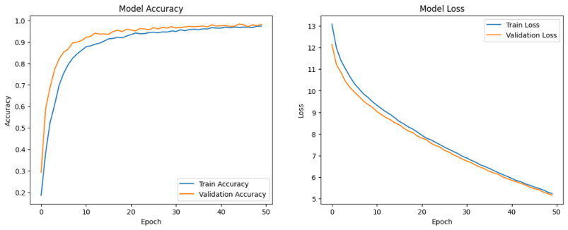
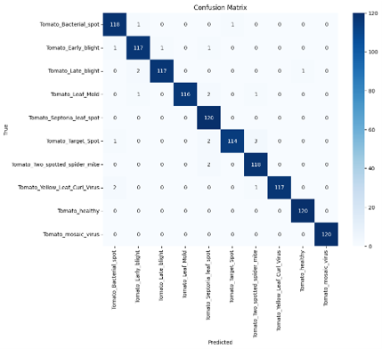
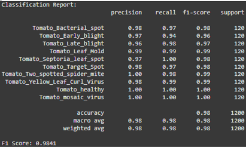
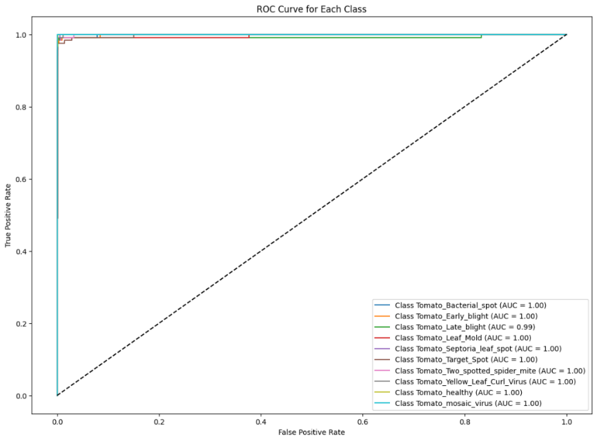
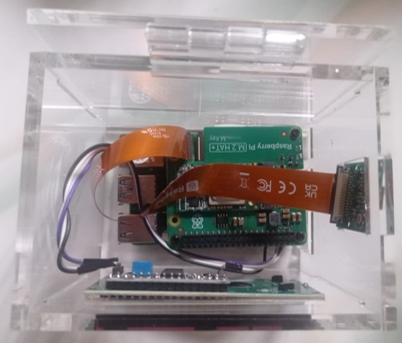
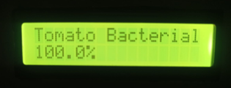
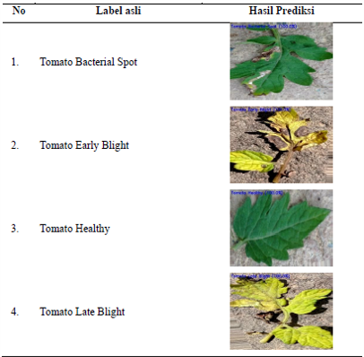
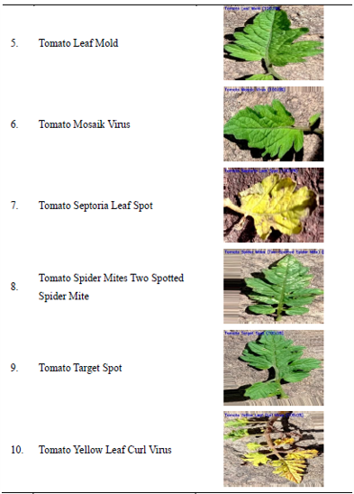

# 🍅 Sistem Deteksi Penyakit Daun Tomat Berbasis Deep Learning (AI + Data Analysis + Edge Deployment)

Sistem end-to-end berbasis Artificial Intelligence untuk mendeteksi penyakit daun tomat secara real-time menggunakan MobileNet, dengan deployment pada Raspberry Pi 5. Proyek ini tidak hanya membangun model AI, tetapi juga melakukan analisis data untuk menghasilkan insight bisnis yang relevan.

---

## 📌 Latar Belakang

Dalam sektor pertanian, deteksi penyakit tanaman secara cepat dan akurat sangat penting untuk mencegah kerugian hasil panen. Sistem manual memiliki keterbatasan dari sisi waktu, konsistensi, dan akurasi.

Proyek ini dikembangkan sebagai solusi berbasis AI yang mampu:

* Mengklasifikasikan penyakit daun tomat secara otomatis
* Memberikan insight berbasis data untuk peningkatan kualitas sistem
* Diimplementasikan langsung pada perangkat edge (tanpa internet)

---

## Tujuan Proyek

* Mengembangkan model klasifikasi penyakit dengan akurasi tinggi
* Menganalisis kualitas data dan performa model
* Mengimplementasikan sistem AI real-time pada perangkat edge
* Memberikan insight untuk pengambilan keputusan berbasis data

---

# DATA ANALYST vs AI ENGINEER

## 📊 Sebagai Data Analyst (Fokus: Insight & Pemahaman Data)

Dalam proyek ini, peran Data Analyst terlihat pada:

* Menganalisis distribusi dataset dan mengidentifikasi ketidakseimbangan data
* Melakukan data balancing untuk meningkatkan kualitas model
* Mengevaluasi performa menggunakan:

  * Confusion Matrix
  * ROC-AUC
  * F1-score
* Mengidentifikasi faktor yang mempengaruhi penurunan performa di dunia nyata

👉 **Fokus utama:**

> Memahami data masa lalu untuk menghasilkan insight yang mendukung pengambilan keputusan

---

## 🤖 Sebagai AI Engineer (Fokus: Sistem & Prediksi)

Dalam proyek ini, peran AI Engineer terlihat pada:

* Membangun model deep learning (MobileNet)
* Melatih dan mengoptimasi model
* Mengkonversi model ke ONNX untuk efisiensi
* Deploy ke Raspberry Pi 5 (edge AI system)
* Mengintegrasikan AI dengan hardware (kamera & LCD)

👉 **Fokus utama:**

> Membangun sistem cerdas yang mampu melakukan prediksi secara real-time

---

# DATASET & ANALISIS DATA

## 📌 Dataset

* Total awal: 18.834 gambar
* Setelah balancing: 8000 gambar
* Jumlah kelas: 10

Sumber Mendeley : J, ARUN PANDIAN; GOPAL, GEETHARAMANI (2019), “Data for: Identification of Plant Leaf Diseases Using a 9-layer Deep Convolutional Neural Network”, Mendeley Data, V1, doi: 10.17632/tywbtsjrjv.1

## 📊 Distribusi Data

Insight:

* Dataset awal tidak seimbang → berpotensi bias model
* Dilakukan balancing untuk meningkatkan generalisasi

---

## Preprocessing

* Resize (224x224)
* Normalisasi
* Augmentasi (rotasi, zoom, brightness)

Insight:

* Augmentasi membantu model lebih robust terhadap variasi data

---

## Split Data

* Training: 70%
* Validation: 15%
* Testing: 15%

---

# ANALISIS PERFORMA MODEL

## Gambar 1. Grafik Accuracy & Loss

Insight:

* Model konvergen dengan stabil
* Tidak terjadi overfitting signifikan
* Training berjalan optimal

---

## Gambar 2. Confusion Matrix

Insight:

* Akurasi tinggi pada hampir semua kelas
* Kesalahan terjadi pada kelas dengan kemiripan visual

👉 **Makna bisnis:**

* Sistem cukup andal untuk penggunaan nyata
* Namun perlu perhatian pada kasus borderline

---

## Gambar 3. Classification Report

Insight:

* F1-score tinggi (≈ 0.97–1.00)
* Precision & recall seimbang

👉 **Makna bisnis:**

* Model tidak hanya akurat, tetapi juga konsisten

---

## Gambar 4. ROC-AUC Curve

Insight:

* AUC = 1.00
* Kemampuan klasifikasi sangat kuat

---

# ⚙️ IMPLEMENTASI SISTEM (AI ENGINEER)

## Gambar 5. Sistem Hardware

Komponen:

* Raspberry Pi 5
* Kamera
* LCD
* Hailo AI Kit

---

## Gambar 6. Hasil Deteksi Real-Time

Insight:

* Sistem mampu memberikan hasil prediksi langsung
* Tidak membutuhkan koneksi internet

👉 **Makna bisnis:**

* Cocok untuk daerah dengan keterbatasan jaringan

---

# ANALISIS HASIL PENGUJIAN

## Gambar 7. Hasil Inferensi Model

Insight:

* Model sangat baik pada data yang mirip training
* Performa tinggi pada kondisi terkendali

---

## Gambar 8. Pengujian Langsung (Real-world)

Insight:

* Akurasi bervariasi (±30% – 100%)
* Dipengaruhi oleh:

  * Pencahayaan
  * Sudut kamera
  * Background

👉 **Makna bisnis:**

* Model perlu data real-world tambahan untuk stabilitas

---

# 📊 INSIGHT BISNIS (DATA ANALYST)

1. Kualitas data sangat mempengaruhi performa model
2. Dataset yang tidak seimbang dapat menyebabkan bias
3. Faktor lingkungan (lighting & noise) mempengaruhi hasil prediksi
4. Model lebih akurat pada data terstruktur dibanding data lapangan

📈 **Implikasi:**

* Perusahaan harus fokus pada kualitas data
* Perlu data real-world untuk meningkatkan performa sistem

---

# 🤖 IMPACT BISNIS (AI ENGINEER)

1. Sistem mampu melakukan deteksi real-time tanpa cloud
2. Mengurangi biaya operasional (tidak perlu server)
3. Dapat digunakan di area pertanian terpencil
4. Membuka peluang pengembangan IoT berbasis AI

**Value untuk perusahaan:**

* Efisiensi biaya
* Monitoring otomatis
* Decision support system

---

# HASIL AKHIR

* Accuracy: 98.42%
* F1-score: 0.9841
* ROC-AUC: 1.00
* Real-time AI berhasil diimplementasikan

---

# 🛠️ TECH STACK

* Python
* TensorFlow / Keras
* ONNX
* OpenCV
* Raspberry Pi 5
* Hailo AI

---

# PENGEMBANGAN LANJUT

* Penambahan dataset real-world
* Integrasi dashboard monitoring
* Deployment berbasis web/mobile
* Multi-crop detection

---

# 👨‍💻 AUTHOR

Fitria Rozi
LinkedIn: www.linkedin.com/in/fitria-rozi-6a344a1b1
---

