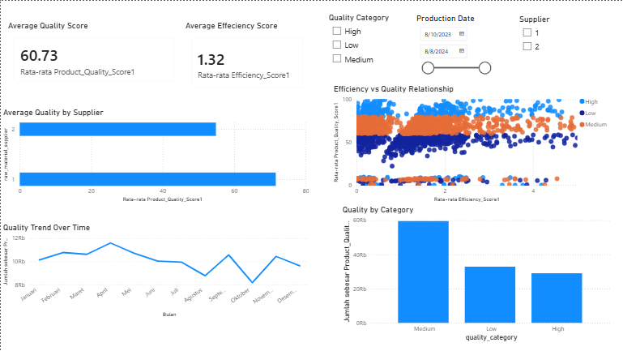

# Power BI Dashboard (Production Analysis)

This dashboard provides interactive visualization and analysis of production performance, focusing on product quality and efficiency.

---

## Objective

To provide real-time insights into:

* Production quality performance
* Efficiency trends
* Key factors affecting production output

---

## Dashboard Features

### 🔹 KPI Monitoring

* Average Quality Score
* Average Efficiency Score

Provides a quick overview of production performance.

---

### 🔹 Supplier Analysis

* Compare product quality across suppliers
* Identify best-performing suppliers

---

### 🔹 Category Analysis

* Analyze quality distribution by category
* Understand performance variations

---

### 🔹 Trend Analysis

* Monthly production quality trends
* Detect fluctuations and patterns over time

---

### 🔹 Efficiency vs Quality (Scatter Plot)

* Analyze relationship between efficiency and product quality
* Identify whether higher efficiency leads to better quality

---

### 🔹 Root Cause Analysis (Decomposition Tree)

* Break down factors affecting product quality
* Analyze impact of:

  * Mixing speed
  * Supplier
  * Category
  * Pigment type

---

## Files

* `Production Data.pbix` → Power BI dashboard file
* `Dashboard.png` → Main dashboard preview
* `Decomposition Tree.png` → Root cause analysis visualization

---

## Dashboard Preview

### Main Dashboard

---

### Root Cause Analysis

---

## Key Insights

* Product quality is influenced by:

  * Mixing speed
  * Supplier
  * Pigment type

* No strong linear relationship between efficiency and quality
  → Increasing efficiency does not always improve product quality

* Certain suppliers consistently produce better results

---

## Business Value

This dashboard can help:

* Monitor production performance in real-time
* Identify areas for improvement
* Support data-driven decision making
* Optimize production processes

---

## Why This Matters

This dashboard simulates a real production monitoring system used in manufacturing environments.

It demonstrates the ability to:

* Translate data into insights
* Build interactive dashboards
* Support operational decision-making

---

