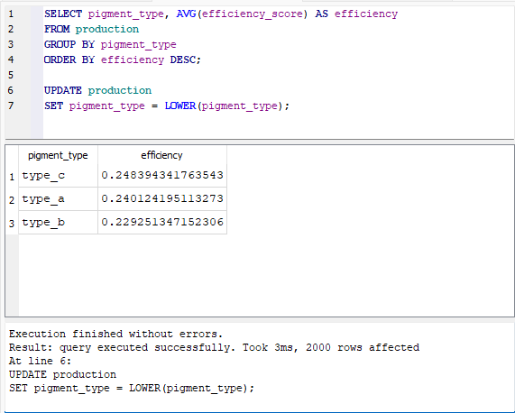
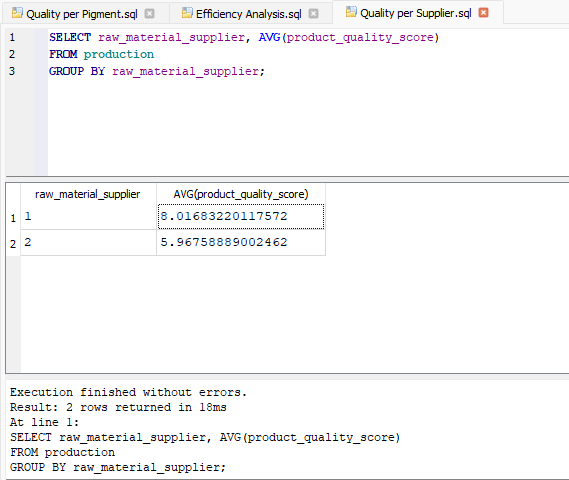
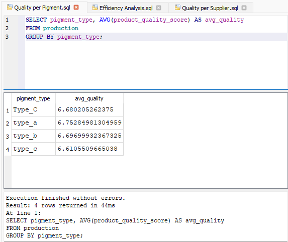

# SQL Analysis (Production Data)

This module contains SQL queries used to analyze production performance.

## Objectives

* Evaluate production efficiency
* Compare product quality across suppliers
* Analyze impact of pigment/material

---

## 📌 1. Efficiency Analysis

* Measures production efficiency trends
* Helps identify performance variations

---

## 📌 2. Quality per Supplier

* Compares product quality across suppliers
* Identifies best-performing supplier

---

## 📌 3. Quality per Pigment

* Analyzes impact of pigment/material on product quality
* Supports optimization of production inputs

---

## Files

* `Efficiency Analysis.sql`
* `Quality per Supplier.sql`
* `Quality per Pigment.sql`

---

## Key Insight

* Supplier and material significantly impact product quality
* Efficiency does not always correlate with higher quality

---

## Purpose

These queries simulate real-world production reporting and support data-driven decision making.

